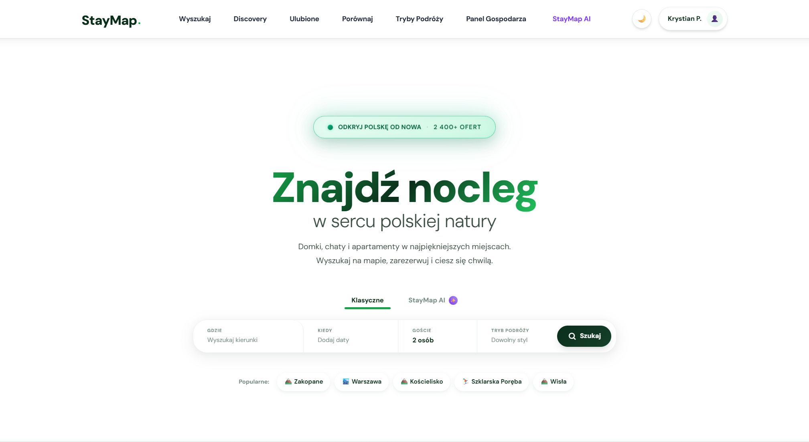
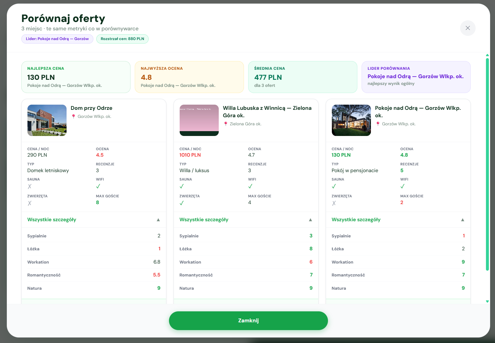
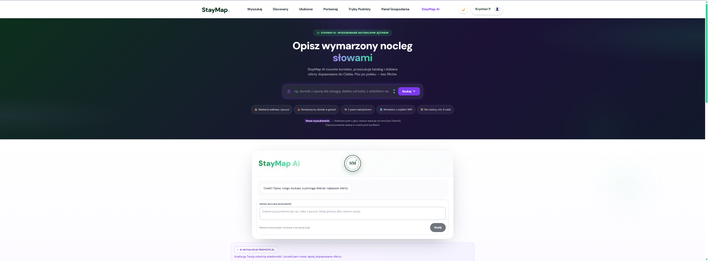
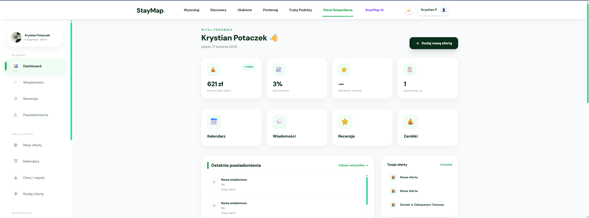
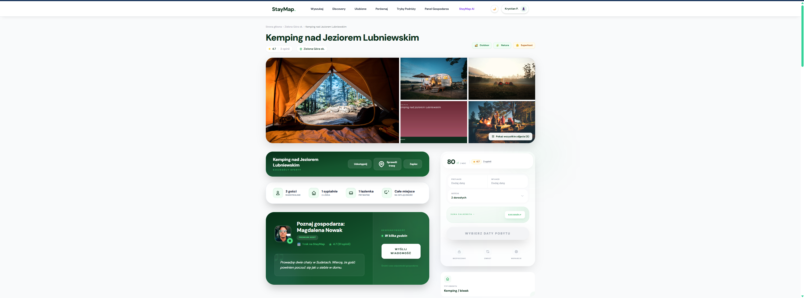

<p align="center">
  
</p>

<h1 align="center">StayMap Polska 🗺️✨</h1>
<p align="center">
  <a href="https://staymap-polska.vercel.app/" target="_blank" rel="noopener noreferrer">
    
  </a>
</p>

<p align="center">
  Platforma rezerwacji noclegow turystycznych w Polsce z podejsciem <b>map-first</b>,
  inteligentnym wyszukiwaniem <b>AI po polsku</b>, dynamicznym pricingiem i komunikacja <b>real-time</b>.
</p>

<p align="center">
  
  
  
  
  
  
</p>

<p align="center">
  <a href="#-quick-start"><b>Quick Start</b></a> •
  <a href="#-biznes-i-produkt"><b>Biznes i produkt</b></a> •
  <a href="#-jak-to-dziala-end-to-end"><b>Jak to dziala</b></a> •
  <a href="#-architektura-systemu"><b>Architektura</b></a> •
  <a href="#-api-kompletny-przeglad"><b>API</b></a> •
  <a href="#-stack-technologiczny"><b>Stack</b></a>
</p>

---

## ⭐ Executive Overview

StayMap Polska to produkcyjna aplikacja marketplace dla rynku noclegow krajowych.
Laczy odkrywanie ofert na mapie, pelny proces rezerwacji, panel hosta, moderacje tresci,
recenzje typu blind release, chat WebSocket i asystenta AI rozumiejacego zapytania po polsku.

### 📊 Projekt w liczbach

| Wskaznik | Wartosc |
|---|---:|
| Moduly backend (Django apps) | 12 |
| Widoki frontend (Next.js) | 44 |
| Pliki testowe | 25 |
| Tryby podrozy | 9 |
| Rynek docelowy | Polska |
| Waluta | PLN |

---

## 💼 Biznes i produkt

### Problem rynkowy

Na rynku brakuje lokalnej platformy, ktora jednoczesnie:
- ma mape jako glowny interfejs odkrywania noclegow,
- uwzglednia polska sezonowosc i swieta w cenach,
- obsluguje caly journey goscia i hosta w jednym systemie.

### Co rozwiazuje StayMap

- **Dla goscia**: szybkie znalezienie i porownanie ofert, transparentna wycena, latwa rezerwacja, kontakt z hostem.
- **Dla hosta**: onboarding, zarzadzanie oferta i kalendarzem, dynamiczne reguly cenowe, obsluga rezerwacji.
- **Dla admina**: moderacja tresci, kontrola jakosci ofert i bezpieczenstwa platformy.

### Kluczowe przewagi

- 🗺️ **Map-first UX** i geowyszukiwanie PostGIS.
- 💰 **Dynamic pricing engine** (sezony, swieta, custom rules, long-stay).
- 🤖 **AI search po polsku** (OpenAI lub kompatybilne API).
- 💬 **Realtime chat** (Channels + WebSocket).
- 🌗 **Blind release recenzji** budujacy zaufanie.
- 📍 **Location intelligence** (POI, ranking destynacji, cache).

---

## 🖼️ Podglad produktu

<table>
  <tr>
    <td width="50%"></td>
    <td width="50%"></td>
  </tr>
  <tr>
    <td align="center"><b>🔎 Wyszukiwanie mapowe</b></td>
    <td align="center"><b>⚖️ Porownywarka ofert</b></td>
  </tr>
  <tr>
    <td width="50%"></td>
    <td width="50%"></td>
  </tr>
  <tr>
    <td align="center"><b>🤖 Asystent AI</b></td>
    <td align="center"><b>🏠 Panel hosta</b></td>
  </tr>
</table>

<p align="center">
  
</p>
<p align="center"><b>🛏️ Karta oferty - szczegoly, udogodnienia i wycena pobytu</b></p>

---

## ⚙️ Jak to dziala (end-to-end)

### 1) Sciezka goscia

1. Gosc uruchamia wyszukiwanie (lokalizacja, daty, liczba osob, tryb podrozy).
2. System geokoduje zapytanie i zwraca oferty na mapie (ranking + filtry).
3. Gosc otwiera karte oferty i liczy cene przez `POST /bookings/quote/`.
4. Tworzy rezerwacje (`PENDING`), potem przechodzi do platnosci (`AWAITING_PAYMENT`).
5. Po potwierdzeniu platnosci rezerwacja ma status `CONFIRMED`.
6. Po pobycie obie strony dodaja recenzje; system publikuje je zgodnie z mechanizmem blind release.

### 2) Sciezka hosta

1. Uzytkownik uruchamia onboarding hosta.
2. Tworzy oferte, dodaje zdjecia, reguly cenowe i dostepnosc.
3. Wysyla oferte do moderacji (`DRAFT -> PENDING`).
4. Po akceptacji (`APPROVED`) oferta trafia do wyszukiwarki i mapy.
5. Host obsluguje rezerwacje oraz komunikacje z gosciem z panelu.

### 3) Sciezka administratora

1. Admin przeglada kolejke moderacyjna ofert `PENDING`.
2. Akceptuje (`APPROVED`) lub odrzuca (`REJECTED`) z komentarzem.
3. Monitoruje jakosc danych, tresci i stan operacyjny systemu.

---

## 🏗️ Architektura systemu

```text
Przegladarka / Mobile Web
        <-> HTTPS
Next.js 14 (SSR + CSR + App Router)
BFF proxy: /api/v1/[...path]
        <-> HTTP REST                 <-> WebSocket
             Daphne ASGI
     Django REST Framework      Django Channels
        <-> ORM/PostGIS  <-> Redis channel layer/cache/queue
      PostgreSQL 16 + PostGIS 3.4      Celery Worker + Beat
        <-> Integracje zewnetrzne
Nominatim | Overpass API | OpenAI/Groq | Google OAuth | SMTP
```

### Warstwy i odpowiedzialnosci

| Warstwa | Technologia | Odpowiedzialnosc |
|---|---|---|
| Frontend | Next.js 14 + TypeScript | SSR/CSR, UI, route handling, BFF proxy |
| API | Django 5 + DRF + Daphne | Endpointy REST, auth, permissions, throttling |
| Realtime | Channels + Redis | Czat i eventy WebSocket |
| Async | Celery Worker + Beat | E-maile, cleanupy, automaty statusow, zadania cykliczne |
| Data | PostgreSQL 16 + PostGIS | Dane transakcyjne i zapytania geograficzne |
| Integracje | OpenAI, OSM, Google OAuth, SMTP | AI, geokodowanie, logowanie social, komunikacja mailowa |

### Przeplyw requestu REST

1. Front wysyla request do BFF (`/api/v1/...`).
2. BFF przekazuje go do backendu Django.
3. Backend robi auth + permissions + walidacje.
4. Serwis domenowy uruchamia logike biznesowa i operacje DB/cache.
5. Odpowiedz JSON wraca przez BFF do klienta.

### Przeplyw realtime (chat)

1. Klient laczy sie przez `ws://.../ws/conversations/{uuid}/?token=<JWT>`.
2. Backend autoryzuje token i podpina kanal konwersacji.
3. Wiadomosc jest zapisywana i emitowana do uczestnikow.
4. Front aktualizuje widok rozmowy bez reloadu.

### Kluczowe zadania asynchroniczne

- cleanup wygaslych sesji AI,
- cleanup sesji porownywarki,
- auto-anulowanie nieoplaconych rezerwacji,
- auto-odrzucanie prosb po deadline,
- przypomnienia o recenzji,
- odswiezanie cache POI i podsumowan lokalizacji.

---

## 🧩 Funkcjonalnosci (pelny zakres)

### Uzytkownicy i auth

- Rejestracja/logowanie e-mail + haslo.
- Google OAuth.
- JWT (access + refresh, rotacja).
- Profil uzytkownika i role (`is_host`, `is_admin`).
- Lista zyczen i zapisane wyszukiwania.

### Listings i discovery

- Lifecycle oferty: `DRAFT`, `PENDING`, `APPROVED`, `REJECTED`, `ARCHIVED`.
- Wyszukiwanie mapowe i ranking ofert.
- Filtry: lokalizacja, daty, goscie, udogodnienia, cena, tryb podrozy.
- Kolekcje discovery i feedy tematyczne.
- Porownywarka do 3 ofert (takze dla anonimowych).

### Pricing i bookings

- Wycena per noc z regualmi sezonowymi i swiatecznymi.
- Doplaty za dodatkowych gosci i rabaty long-stay.
- Snapshot ceny na moment rezerwacji.
- Tryby rezerwacji: `INSTANT` i `REQUEST`.
- Historia statusow i logika deadline dla hosta.

### Host panel

- Onboarding hosta.
- CRUD ofert i upload zdjec.
- Zarzadzanie dostepnoscia i cennikiem.
- Obsluga rezerwacji i decyzji hosta.
- Szablony wiadomosci i statystyki.

### Moderacja

- Kolejka ofert oczekujacych na decyzje.
- Akcje approve/reject z komentarzem.
- Dostep tylko dla roli admin.

### Recenzje

- Recenzje goscia i hosta.
- Blind release (publikacja po spelnieniu warunkow).
- Odpowiedz hosta do recenzji.

### Messaging

- Rozmowy 1:1 powiazane z oferta.
- REST API do listy i historii rozmow.
- WebSocket eventy `message.new`, `typing`, `read`.

### AI Assistant

- Wyszukiwanie po naturalnym jezyku polskim.
- Interpretacja intencji i mapowanie na filtry.
- Generowanie wyjasnien dopasowania ofert.
- Sesje AI z TTL i limity kosztowe.

### Location intelligence

- Pobieranie POI z Overpass API.
- Cache lokalizacji i podsumowania obszarow.
- Destination score wspierajacy ranking ofert.

---

## 🔌 API (kompletny przeglad)

> [!NOTE]
> Pelny kontrakt i wszystkie schematy danych znajdziesz w Swagger UI: `http://localhost:8000/api/schema/swagger-ui/`

### Prefix

- `/api/v1/`

### Obszary endpointow

| Domena | Endpointy kluczowe |
|---|---|
| Auth | `POST /auth/register/`, `POST /auth/token/`, `POST /auth/token/refresh/`, `POST /auth/google/`, `GET/PATCH /auth/me/` |
| Listings/Search | `GET /listings/search/`, `GET /listings/{slug}/`, `GET /listings/{slug}/price-calendar/` |
| Bookings | `POST /bookings/quote/`, `POST /bookings/`, `GET /bookings/me/`, `DELETE /bookings/{uuid}/` |
| Host | `POST /host/onboarding/start/`, `GET/POST /host/listings/`, `GET/PATCH/DELETE /host/listings/{uuid}/`, `POST /host/listings/{uuid}/images/`, `POST /host/listings/{uuid}/submit-for-review/`, `GET /host/bookings/`, `PATCH /host/bookings/{uuid}/status/` |
| Moderacja | `GET /admin/moderation/listings/`, `POST /admin/moderation/listings/{uuid}/approve/`, `POST /admin/moderation/listings/{uuid}/reject/` |
| Reviews | `POST /reviews/`, `PATCH /reviews/{uuid}/host-response/` |
| Messaging | `GET/POST /conversations/`, `GET/POST /conversations/{uuid}/messages/` |
| Discovery/Compare | `GET /discovery/`, `GET/POST /compare/`, `POST /compare/listings/` |
| AI | `POST /ai/search/`, `GET /ai/search/{session_id}/`, `POST /ai/search/{session_id}/prompt/` |
| System | `GET /health/`, `GET /api/schema/swagger-ui/` |

### API standardy

- JSON responses i ujednolicone kody bledow.
- UUID jako identyfikatory zasobow.
- Cursor pagination tam, gdzie potrzebna.
- Rozdzielenie permissions per rola (guest/host/admin).
- Rate limiting i walidacja wejscia po stronie backendu.

### Realtime API

- WebSocket: `ws://localhost:8000/ws/conversations/{uuid}/?token=<JWT>`
- Eventy typowe: `message.new`, `typing.start`, `typing.stop`, `message.read`

---

## 🧰 Stack technologiczny

### Backend

- Python 3.12
- Django 5.1.x
- Django REST Framework
- GeoDjango + PostGIS
- SimpleJWT + Google OAuth
- Django Channels + Daphne
- Celery + django-celery-beat
- Redis (cache, broker, channel layer)
- drf-spectacular (OpenAPI/Swagger)
- pytest + pytest-django + Faker
- ruff

### Frontend

- Next.js 14 (App Router), React 18, TypeScript
- Tailwind CSS
- Radix UI
- Leaflet + react-leaflet + markercluster
- react-hook-form + zod
- Zustand
- framer-motion
- Playwright (E2E)

### Infra / DevEx

- Docker Compose
- Makefile
- GitHub Actions
- Opcjonalny S3 storage (`USE_S3=True`)
- Sentry monitoring (production)

### Integracje zewnetrzne

- OpenStreetMap Nominatim (geocoding)
- Overpass API (POI)
- OpenAI / OpenAI-compatible API (AI)
- Google OAuth
- SMTP (mailing transakcyjny)

---

## 🚀 Quick Start

> [!TIP]
> Najszybszy start lokalny: Docker + Makefile.

### Wymagania

- Docker Desktop
- `.env` (na bazie `.env.example`)

### Uruchomienie

```bash
make dev
```

Po starcie:
- Frontend: `http://localhost:3000`
- API: `http://localhost:8000`
- Swagger: `http://localhost:8000/api/schema/swagger-ui/`
- Admin: `http://localhost:8000/admin/`

### Pierwsza konfiguracja

```bash
make migrate
make superuser
make seed
```

### Profil Celery (opcjonalny)

```bash
docker compose --profile celery up -d
```

---

## 🧪 Developer Commands

```bash
make dev
make down
make migrate
make migrations
make superuser
make seed
make test
make test-fast
make lint
```

---

## 🔐 Bezpieczenstwo i jakosc

- JWT w HTTP-only cookies + rotacja refresh tokenow.
- Permission classes: `IsAuthenticated`, `IsHost`, `IsAdmin`.
- Soft delete i UUID jako PK.
- Audit log dla istotnych operacji.
- MIME validation uploadow (Pillow + python-magic).
- Throttling endpointow auth/upload/AI.
- Sentry do monitoringu bledow.
- CI quality gate: ruff + pytest + Playwright.

> [!WARNING]
> `JWT_SECRET` po stronie Next.js musi byc zgodny z Django `SECRET_KEY`.

---

## 📦 Wazne informacje operacyjne

- W produkcji uruchamiaj tylko **jeden** proces Celery Beat (singleton).
- Dla WebSocket wymagany jest poprawny deployment warstwy ASGI.
- Redis odpowiada jednoczesnie za cache, broker Celery i channels layer.
- Stripe jest przygotowany infrastrukturalnie, ale wymaga konfiguracji biznesowej.

---

## 🛣️ Roadmap

- 🤖 AI "Kiedy jechac?" - rekomendacja najlepszego terminu.
- 🕒 "W X godzin" (izochrony) - wyszukiwanie po czasie dojazdu.
- 📸 Pamietnik z podrozy - zdjecia gosci po pobycie.
- 🎁 Karty podarunkowe - vouchery i realizacja w rezerwacji.
- 🗺️ Mapa wspomnien - historia podrozy usera na mapie.

---

## 📚 Dokumentacja

- `docs/StayMap_Dokumentacja_Biznesowa_v2.md`
- `docs/StayMap_Dokumentacja_Biznesowa_v2.pdf`
- `docs/StayMap_Dokumentacja_Biznesowa_v2.docx`

<details>
  <summary><b>Pokaz strukture monorepo</b></summary>

```text
staymap-polska/
├─ backend/
├─ frontend/
├─ docs/
├─ docker/
├─ docker-compose.yml
└─ Makefile
```

</details>

---


<p align="center">
  <b>StayMap Polska</b><br/>
  Mapa w centrum. AI po polsku. Uczciwe recenzje. Produkcyjna architektura.
</p>
