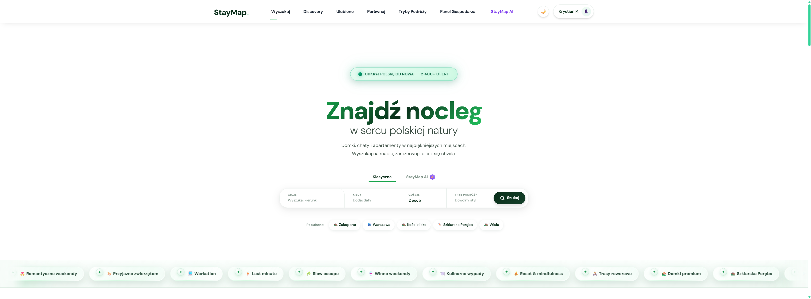

# StayMap Polska

> Nowoczesna platforma rezerwacji noclegów turystycznych w Polsce z podejściem **map-first**, dynamicznym cennikiem i asystentem AI.


---

## Spis tresci

- [1. O projekcie](#1-o-projekcie)
- [2. Najwazniejsze wyrozniki](#2-najwazniejsze-wyrozniki)
- [3. Podglad aplikacji](#3-podglad-aplikacji)
- [4. Architektura](#4-architektura)
- [5. Stack technologiczny](#5-stack-technologiczny)
- [6. Struktura monorepo](#6-struktura-monorepo)
- [7. Szybki start (Docker)](#7-szybki-start-docker)
- [8. Komendy developerskie](#8-komendy-developerskie)
- [9. Kluczowe endpointy API](#9-kluczowe-endpointy-api)
- [10. Bezpieczenstwo i jakosc](#10-bezpieczenstwo-i-jakosc)
- [11. Operacje i wdrozenie](#11-operacje-i-wdrozenie)
- [12. Roadmap](#12-roadmap)
- [13. Dokumentacja](#13-dokumentacja)

---

## 1. O projekcie

**StayMap Polska** to kompletna platforma noclegowa zbudowana pod polski rynek turystyczny.
Goscie odkrywaja i porownuja oferty na interaktywnej mapie, rezerwuja online, rozmawiaja z hostem w czasie rzeczywistym i korzystaja z wyszukiwania AI po polsku.

### W liczbach

| Wskaznik | Wartosc |
|---|---:|
| Moduly backend | 12 aplikacji Django |
| Widoki frontend | 44 strony Next.js |
| Pliki testowe | 25 |
| Tryby podrozy | 9 |
| Rynek docelowy | Polska |
| Waluta | PLN |

---

## 2. Najwazniejsze wyrozniki

- **Map-first UX**: mapa Leaflet i klasteryzacja markerow jako glowny interfejs wyszukiwania.
- **Dynamiczny cennik**: sezonowosc, polskie swieta, reguly hosta i rabaty long-stay.
- **Asystent AI**: naturalny jezyk polski (OpenAI / kompatybilne API, np. Groq).
- **Czat WebSocket**: komunikacja gosc-host w czasie rzeczywistym.
- **Blind Release recenzji**: uczciwe, niezalezne recenzje obu stron przed publikacja.
- **Inteligencja lokalizacji**: POI z OSM/Overpass + scoring destynacji.
- **Porownywarka ofert**: porownanie do 3 ofert side-by-side (anonim i user zalogowany).

---

## 3. Podglad aplikacji

### Glowny ekran



### Wyszukiwanie mapowe


### Porownywarka ofert


### Asystent AI


### Panel gospodarza


### Karta oferty


---

## 4. Architektura

```text
Przegladarka / Mobile Web
        <-> HTTPS
Next.js 14 (SSR + CSR + App Router)
BFF proxy: /api/v1/[...path]
        <-> HTTP REST                 <-> WebSocket
             Daphne ASGI
     Django REST Framework      Django Channels
        <-> ORM/PostGIS  <-> Redis channel layer/cache/queue
      PostgreSQL 16 + PostGIS      Celery Worker + Beat
        <-> Integracje zewnetrzne
Nominatim | Overpass API | OpenAI/Groq | Google OAuth | SMTP
```

### Kluczowe warstwy

- **Frontend (Next.js 14)**: SSR/CSR, BFF proxy, nowoczesny UI.
- **API (Django + DRF)**: endpointy REST, autoryzacja JWT, throttling.
- **Realtime (Channels + Daphne)**: WebSocket dla czatu.
- **Async (Celery + Redis)**: e-maile, harmonogramy, zadania cykliczne.
- **Geo (GeoDjango + PostGIS)**: zapytania przestrzenne i ranking lokalizacji.

---

## 5. Stack technologiczny

### Backend

- Python 3.12
- Django 5.1.x
- Django REST Framework
- GeoDjango + PostGIS
- SimpleJWT + Google OAuth
- Django Channels + Daphne
- Celery + django-celery-beat
- Redis (cache, broker, channels)
- drf-spectacular (OpenAPI / Swagger)
- pytest + pytest-django + Faker
- ruff

### Frontend

- Next.js 14 (App Router), React 18, TypeScript
- Tailwind CSS
- Radix UI
- Leaflet + react-leaflet + markercluster
- react-hook-form + zod
- Zustand
- framer-motion
- Playwright (E2E)

### Infrastruktura

- Docker Compose
- Makefile (przyspieszenie pracy dev)
- GitHub Actions (lint + testy)

---

## 6. Struktura monorepo

```text
staymap-polska/
├─ backend/      # Django, DRF, Channels, Celery, PostGIS
├─ frontend/     # Next.js 14, TypeScript, UI i e2e
├─ docs/         # Dokumentacja biznesowa i zrzuty ekranu
├─ docker/       # Dockerfile backendu
├─ docker-compose.yml
└─ Makefile
```

---

## 7. Szybki start (Docker)

### Wymagania

- Docker Desktop
- Plik `.env` w katalogu glownym (na bazie `.env.example`)

### Uruchomienie lokalne

```bash
make dev
```

Po starcie:

- Frontend: `http://localhost:3000`
- API: `http://localhost:8000`
- Swagger: `http://localhost:8000/api/schema/swagger-ui/`
- Django Admin: `http://localhost:8000/admin/`

### Pierwsza konfiguracja bazy

```bash
make migrate
make superuser
make seed
```

### Uslugi Celery (profil opcjonalny)

```bash
docker compose --profile celery up -d
```

---

## 8. Komendy developerskie

```bash
make dev
make down
make migrate
make migrations
make superuser
make seed
make test
make test-fast
make lint
```

---

## 9. Kluczowe endpointy API

Prefiks: `/api/v1/`

| Obszar | Metody | Endpoint |
|---|---|---|
| Auth | `POST` | `auth/register/`, `auth/token/`, `auth/token/refresh/`, `auth/google/` |
| Profil | `GET`, `PATCH` | `auth/me/` |
| Listings | `GET` | `listings/search/`, `listings/{slug}/`, `listings/{slug}/price-calendar/` |
| Bookings | `POST`, `GET`, `DELETE` | `bookings/quote/`, `bookings/`, `bookings/me/`, `bookings/{uuid}/` |
| Host | `POST`, `GET`, `PATCH`, `DELETE` | `host/onboarding/start/`, `host/listings/`, `host/bookings/{uuid}/status/` |
| Moderacja | `GET`, `POST` | `admin/moderation/listings/`, `{uuid}/approve/`, `{uuid}/reject/` |
| Reviews | `POST`, `PATCH` | `reviews/`, `reviews/{uuid}/host-response/` |
| Messaging | `GET`, `POST` | `conversations/`, `conversations/{uuid}/messages/` |
| Discovery | `GET`, `POST` | `discovery/`, `compare/`, `compare/listings/` |
| AI | `POST`, `GET` | `ai/search/`, `ai/search/{session_id}/`, `ai/search/{session_id}/prompt/` |

WebSocket:

- `ws://localhost:8000/ws/conversations/{uuid}/?token=<JWT>`

---

## 10. Bezpieczenstwo i jakosc

- **JWT w HTTP-only cookies** + rotacja refresh tokenow.
- **Role i uprawnienia**: `IsAuthenticated`, `IsHost`, `IsAdmin`.
- **Soft delete** i **UUID** jako PK (mniejsze ryzyko IDOR).
- **AuditLog** dla dzialan istotnych operacyjnie.
- **Walidacja MIME uploadow** (Pillow + python-magic).
- **Throttling** na endpointach auth/upload/AI.
- **Sentry** do monitoringu produkcyjnego.
- **CI/CD**: ruff + pytest + E2E Playwright.

---

## 11. Operacje i wdrozenie

### Kluczowe komponenty produkcyjne

- PostgreSQL 16 + PostGIS
- Redis 7
- Daphne (WebSocket) + Gunicorn/Daphne (HTTP/WS)
- Celery Worker + Celery Beat (singleton)
- Nginx (TLS + reverse proxy)
- SMTP (Gmail App Password lub SendGrid)
- S3 (opcjonalnie)

### Uwaga krytyczna

`JWT_SECRET` po stronie Next.js musi byc zgodny z Django `SECRET_KEY`.

---

## 12. Roadmap

Planowane kierunki rozwoju:

- **AI "Kiedy jechac?"**: rekomendacja najlepszego terminu i kalendarz cen.
- **"W X godzin" (izochrony)**: wyszukiwanie wg czasu dojazdu.
- **Pamietnik z podrozy**: galerie zdjec gosci po pobycie.
- **Karty podarunkowe**: voucher + realizacja w rezerwacji.
- **Mapa wspomnien**: historia podrozy usera na mapie.

---

## 13. Dokumentacja

- Pelna dokumentacja biznesowa: `docs/StayMap_Dokumentacja_Biznesowa_v2.md`
- Wersja PDF: `docs/StayMap_Dokumentacja_Biznesowa_v2.pdf`
- Wersja DOCX: `docs/StayMap_Dokumentacja_Biznesowa_v2.docx`

---

## Licencja

Brak zdefiniowanej licencji w repozytorium.
W przypadku publikacji open source dodaj plik `LICENSE` (np. MIT).

---

**StayMap Polska**

Platforma zaprojektowana od podstaw pod polskiego podroznika: mapa w centrum, AI po polsku, uczciwe recenzje i dynamiczny silnik cenowy gotowy na realny rynek.
