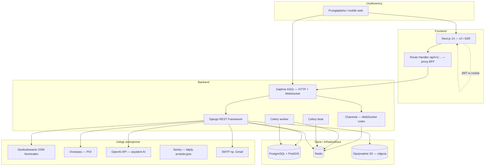
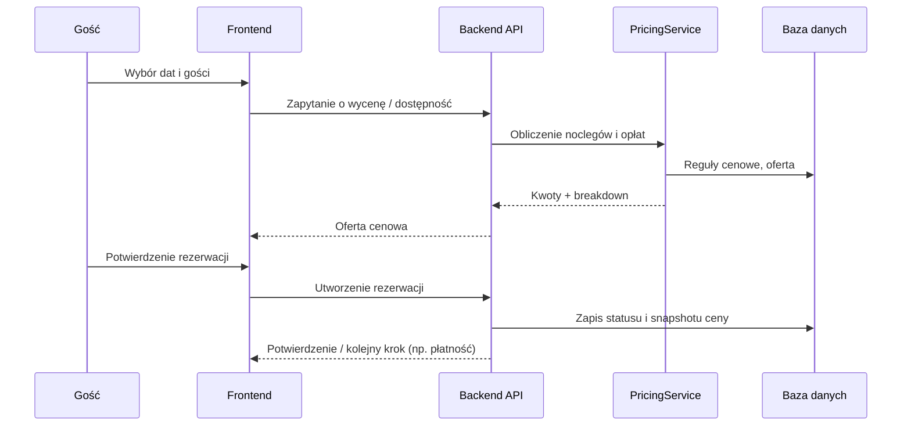

# StayMap Polska — dokumentacja końcowa projektu

**Wersja dokumentu:** 1.0 (kwiecień 2026)  
**Przeznaczenie:** przegląd dla zarządu i interesariuszy — architektura, zakres funkcji, zależności i eksploatacja  
**Repozytorium:** monorepo (backend Django + frontend Next.js)

---

## 1. Streszczenie wykonawcze

**StayMap Polska** to platforma do wyszukiwania i rezerwacji noclegów w Polsce z naciskiem na doświadczenie „map-first”: użytkownik odkrywa oferty na mapie, porównuje je, planuje pobyt i finalizuje rezerwację. Po stronie **gospodarza** system wspiera tworzenie ofert, kalendarz, cennik (w tym sezonowość i święta), komunikację z gościem oraz moderację treści.

Technicznie jest to **aplikacja dwuwarstwowa**: backend **REST API** (Django + PostGIS) oraz **frontend** (Next.js 14), z warstwą pośrednią BFF w Next.js do proxy do API. Asynchroniczne zadania (e-maile, porządki danych, przypomnienia) działają w **Celery** z **Redis** jako brokerem; czat w czasie rzeczywistym używa **WebSocketów** (Django Channels + Daphne).

**Kluczowa wartość biznesowa:** jeden spójny produkt obejmujący wyszukiwanie geograficzne, rezerwacje z rozbiciem cenowym, profile hosta i gościa, recenzje, wiadomości oraz moduły wspierające odkrywanie ofert (np. strona główna, porównywarka, asystent AI do wyszukiwania w języku naturalnym).

---

## 2. Cel produktu i grupy użytkowników

| Grupa | Potrzeby | Obsługa w systemie |
|--------|-----------|---------------------|
| **Gość** | Znaleźć nocleg, sprawdzić dostępność i cenę, zarezerwować, zarządzać kontem, listą życzeń, wiadomościami | Wyszukiwanie, karta oferty, rezerwacja, konto, wishlist, czat |
| **Gospodarz** | Publikować oferty, ustalać ceny i kalendarz, obsługiwać rezerwacje i gości | Panel hosta, onboarding, listy ofert, rezerwacje, szablony wiadomości |
| **Administrator / moderacja** | Akceptować lub odrzucać oferty przed publikacją | Kolejka moderacji w API + widoki dla kont z uprawnieniami |

---

## 3. Architektura logiczna

### 3.1 Widok z lotu ptaka

**Dlaczego tak:** PostGIS daje wydajne zapytania przestrzenne (np. oferty w zasięgu), Redis łączy cache, kolejkę Celery i kanały Django Channels, a Daphne obsługuje jednym procesem zarówno HTTP API, jak i WebSockety.

### 3.2 Przepływ typowego żądania (REST)

1. Użytkownik w przeglądarce wywołuje akcję na froncie (np. wyszukanie ofert).
2. Frontend może trafiać w **BFF** (`/api/v1/...` w Next.js), który przekazuje żądanie do Django pod `/api/v1/...` (ułatwia SSR i spójny adres wewnętrzny w Dockerze: `INTERNAL_API_URL` / `DJANGO_API_URL`).
3. Django weryfikuje **JWT** (nagłówek `Authorization` lub mechanizm uzgodniony z frontem), stosuje **uprawnienia** i **limity** (throttling), wykonuje logikę w **serwisach** i zwraca JSON w ujednoliconym formacie (w tym kody błędów StayMap).

### 3.3 WebSocket (czat)

Połączenia `ws://.../ws/conversations/<uuid>/` są obsługiwane przez **Django Channels** z middleware JWT; zdarzenia (np. nowa wiadomość) są rozsyłane przez warstwę kanałów opartą o Redis.

---

## 4. Stack technologiczny

### 4.1 Backend (`backend/`)

| Obszar | Technologia |
|--------|-------------|
| Język | Python 3.12 (CI), kompatybilnie z obrazem Dockera |
| Framework | Django 5.x |
| API | Django REST Framework 3.x, OpenAPI przez **drf-spectacular** (Swagger UI pod `/api/schema/swagger-ui/`) |
| Geo | **GeoDjango** + **PostGIS** |
| Auth | **djangorestframework-simplejwt** (access + refresh, rotacja) |
| Realtime | **channels**, **channels-redis**, serwer **daphne** |
| Async | **Celery 5**, **django-celery-beat** |
| Cache | **redis**, **django-redis** |
| Pliki / S3 | **boto3**, **django-storages** (konfiguracja przez `USE_S3`) |
| Jakość | **ruff**, **pytest** (CI) |
| Monitoring (prod.) | **sentry-sdk** |

Główne zależności są w `backend/requirements/base.txt`; środowisko developerskie rozszerza je o `development.txt`, produkcja — `production.txt` (**Gunicorn**, **WhiteNoise**).

### 4.2 Frontend (`frontend/`)

| Obszar | Technologia |
|--------|-------------|
| Framework | **Next.js 14** (App Router), **React 18**, **TypeScript** |
| Styling | **Tailwind CSS** |
| Formularze / walidacja | **react-hook-form**, **zod**, **@hookform/resolvers** |
| Mapy | **Leaflet** + **markercluster** |
| Stan globalny | **zustand** |
| UX | **framer-motion**, **react-hot-toast**, komponenty **Radix** (dialog, popover) |
| Testy E2E | **Playwright** |

### 4.3 Infrastruktura lokalna

- **Docker Compose**: `postgis/postgis`, `redis`, serwis `backend`, `frontend`; opcjonalnie **Celery** (`--profile celery`).
- **Makefile**: skróty `make dev`, `migrate`, `seed`, `test`, `lint`.

---

## 5. Struktura backendu (moduły domenowe)

Logika jest podzielona na aplikacje Django (`apps/`), zgodnie z podejściem „jedna domena — jeden pakiet”:

| Aplikacja | Rola |
|-----------|------|
| **users** | Użytkownik (e-mail jako login), rejestracja, logowanie, Google OAuth, profil (`UserProfile`), wishlist, zapisane wyszukiwania |
| **common** | Modele bazowe (`BaseModel`, soft delete), audyt (`AuditLog`), wyjątki API, paginacja, middleware WebSocket JWT, health checks |
| **listings** | Oferty, lokalizacja (PostGIS), zdjęcia, szczegóły pod slugiem, kalendarz cen/dostępności, integracja z oceną destynacji i POI |
| **pricing** | Silnik cen: noce, sezonowość, święta PL, dodatkowe „szczyty” podróżowe, reguły hosta, opłaty i prowizja platformy |
| **bookings** | Rezerwacje, statusy, historia, blokady kalendarza, powiązanie z płatnością (identyfikatory Stripe w modelu — pod przyszłą lub częściową integrację) |
| **search** | Wyszukiwanie ofert, geokodowanie (Nominatim), regiony SEO |
| **host** | Onboarding hosta, CRUD ofert po stronie hosta, rezerwacje hosta, statystyki, powiadomienia, recenzje po stronie hosta |
| **moderation** | Kolejka ofert `pending`, akceptacja / odrzucenie |
| **reviews** | Recenzje po pobycie, odpowiedź hosta, przypomnienia e-mail (Celery) |
| **messaging** | Konwersacje REST + WebSocket, szablony wiadomości dla hosta |
| **ai_assistant** | Sesje wyszukiwania w języku naturalnym (OpenAI), historia sesji, limity i porządki TTL |
| **discovery** | Feed strony głównej / odkrywanie, **porównywarka** ofert (sesja po stronie serwera, limity liczby obiektów i TTL) |
| **location_intelligence** | Cache POI (Overpass), podsumowania obszarów, wyniki „w pobliżu” — odciążenie zewnętrznych API |

Wzorzec implementacji: **widok → serializer → serwis → model**, żeby logika biznesowa nie rozlewała się po kontrolerach.

---

## 6. Funkcjonalności — przegląd dla zarządu

Poniżej: **co** robi system, **po co** i **w skrócie jak** (bez implementacji linijka po linijce).

### 6.1 Konta i tożsamość

- **Rejestracja i logowanie** e-mail/hasło oraz **Google**; tokeny JWT z ograniczoną żywotnością i odświeżaniem.
- **Profil konta** (m.in. dane osobowe, preferencje, avatar): spójne API `GET/PATCH` pod `/api/v1/auth/me/` (alias `/api/v1/profile/`).
- **Role**: flagi `is_host`, `is_admin` — ten sam użytkownik może być gościem i gospodarzem.

### 6.2 Oferty i wyszukiwanie

- **Lista i szczegóły ofert** z filtrowaniem; oferty publicznie widoczne w statusie zatwierdzonym; szkice i oczekujące widoczne dla właściciela.
- **Geokodowanie** adresów/zapytań przez Nominatim (wymagany poprawny User-Agent — polityka OSM).
- **Mapa wyszukiwania** (frontend: Leaflet, klastry markerów).
- **Regiony** (np. pod SEO / landing pages): endpoint regionów w API wyszukiwania.
- **Kalendarz cen** i **kalendarz zajętości** dla oferty: podgląd cen noclegów i dni zablokowanych/zarezerwowanych.

### 6.3 Cennik i rezerwacje

- **PricingService** wylicza cenę za pobyt: baza × mnożniki (sezon, święta, reguły hosta), opłaty dodatkowe (np. goście powyżej limitu, sprzątanie), **prowizja platformy** (parametr konfiguracyjny).
- **Tryb rezerwacji**: natychmiastowa albo „na prośbę” — wpływa na status początkowy i akceptację przez hosta w oknie czasowym.
- **Rezerwacja** zapisuje **snapshot** rozbicia ceny w JSON (`pricing_breakdown`) — ważne prawnie i operacyjnie: cena „zamrożona” w momencie transakcji.
- **Celery** okresowo anuluje porzucone rezerwacje i automatycznie odrzuca przeterminowane prośby — mniej ręcznej pracy i czyściejszy kalendarz.

### 6.4 Gospodarz

- **Onboarding**: uruchomienie profilu hosta z poziomu API.
- **Tworzenie i edycja ofert**, upload zdjęć (limity, throttling), **wysłanie do moderacji**.
- **Zarządzanie rezerwacjami**: lista, zmiana statusu (potwierdzenie / odrzucenie).
- **Reguły cenowe** w panelu (sezon, święta, długi pobyt itd. — zgodnie z modelami w `pricing`).
- **Powiadomienia i recenzje** po stronie hosta — dedykowane endpointy pod panelem.

### 6.5 Moderacja

- Kolejka ofert oczekujących; **akceptacja** lub **odrzucenie z komentarzem** — jakość treści przed publikacją.

### 6.6 Recenzje

- Gość może ocenić pobyt; host może **raz** odpowiedzieć na recenzję.
- **Przypomnienia e-mail** o wystawieniu oceny uruchamiane harmonogramem Celery.

### 6.7 Komunikacja (czat)

- **REST**: lista konwersacji, tworzenie, historia wiadomości.
- **WebSocket**: powiadomienia o nowych wiadomościach w czasie rzeczywistym; autoryzacja tokenem JWT.

### 6.8 Asystent AI

- Endpointy pod **wyszukiwanie konwersacyjne** z interpretacją zapytań i powiązaniem z ofertami (limity sesji, koszty, sprzątanie starych sesji — zadania Celery).
- Raportowanie kosztów AI w harmonogramie (np. miesięcznie) — transparentność operacyjna.

### 6.9 Odkrywanie i porównywanie

- **Discovery** — treści pod stronę główną / odkrywanie (feed API).
- **Compare** — sesja porównawcza z limitem liczby ofert i czasem życia; czyszczenie wygasłych sesji w tle.

### 6.10 Inteligencja lokalizacji

- **POI i „co w okolicy”** z cache (Overpass jest kosztowny czasowo; cache odświeżany w harmonogramie nocnym).
- **Destination score** — wzbogacenie oferty o ocenę atrakcyjności okolicy (cache w modelu oferty).

### 6.11 Strony informacyjne i SEO (frontend)

- Strony m.in.: kontakt, polityka prywatności, regulamin, pomoc, kariera — typowe dla zaufania marki i wymagań prawnych.

---

## 7. Frontend — mapa aplikacji (App Router)

Grupy tras:

- **`(main)`** — witryna dla gościa: strona główna, wyszukiwanie, szczegóły oferty, rezerwacje, konto, wishlist, wiadomości, porównanie, AI, discovery, podróże (tryby), booking flow.
- **`(auth)`** — logowanie, rejestracja.
- **`(host)`** — panel gospodarza: dashboard, oferty, kalendarz, rezerwacje, wiadomości, ustawienia, wypłaty/zarobki (widoki zgodne z zakresem biznesowym).

**BFF** (`frontend/src/app/api/v1/[...path]/route.ts`): proxy HTTP do Django z obsługą błędu „backend niedostępny” (kod `UPSTREAM_UNAVAILABLE`).

**Uwaga środowiskowa:** `JWT_SECRET` po stronie Next.js musi być zgodny z `SECRET_KEY` Django, jeśli middleware weryfikuje token z ciasteczka — inaczej możliwe błędy 500 przy starcie (opisane w dokumentacji operacyjnej).

---

## 8. Bezpieczeństwo i jakość danych

- **JWT** zamiast sesji serwerowych w klasycznym sensie; rotacja refresh tokenów zgodnie z ustawieniami SimpleJWT.
- **Soft delete** na modelach bazowych — mniejsze ryzyko utraty historii przy błędzie użytkownika.
- **Uprawnienia per endpoint** — gość vs host vs admin.
- **Throttling** na wrażliwych akcjach (np. upload, endpointy obciążające).
- **Audyt** (`AuditLog`) — ślad działań dla wsparcia i compliance.
- **Sentry** w konfiguracji produkcyjnej — szybka diagnostyka po wdrożeniu.
- **Walidacja plików** (m.in. Pillow, python-magic w stacku) — ograniczenie ryzyka złośliwych uploadów.

---

## 9. Operacje: co musi działać w produkcji

| Komponent | Rola |
|-----------|------|
| **PostgreSQL + PostGIS** | Źródło prawdy |
| **Redis** | Cache, broker Celery, Channels |
| **Celery worker + beat** | Zadania cykliczne i asynchroniczne |
| **Daphne / Gunicorn** | Dev: Daphne (HTTP+WS); prod: typowo Gunicorn dla HTTP + osobno Daphne dla WS lub ujednolicony ASGI — decyzja wdrożeniowa |
| **SMTP** | E-maile transakcyjne (szablony w `backend/templates/emails/`) |
| **S3 (opcjonalnie)** | Skalowalny storage zdjęć |

Szczegóły e-mail, Sentry i Celery: `docs/EMAIL_AND_OPS.md`.

### Harmonogram Celery (fragment — pełna lista w kodzie)

- Co 30 min: anulowanie porzuconych rezerwacji.
- Co godzinę: auto-odrzucenie przeterminowanych próśb.
- Nocą: odświeżanie cache POI i podsumowań obszarów.
- Codziennie: przypomnienia o recenzjach.
- Co miesiąc: raport kosztów AI.

---

## 10. Testy i CI

- **GitHub Actions** (`.github/workflows/ci.yml`): na gałęziach `main` / `develop` uruchamiane są **ruff** oraz **pytest** z bazą PostGIS i Redis w usługach kontenerowych.
- **Playwright** — testy E2E frontu (`frontend/package.json`).

To daje powtarzalną weryfikację regresji przy zmianach.

---

## 11. Zależności zewnętrzne (usługi i dane)

| Usługa | Po co |
|--------|--------|
| **OpenStreetMap / Nominatim** | Geokodowanie (adres → współrzędne) |
| **Overpass API** | Punkty zainteresowania w okolicy |
| **OpenAI** | Asystent wyszukiwania w języku naturalnym |
| **Google OAuth** | Logowanie kontem Google (wymaga `GOOGLE_OAUTH_CLIENT_ID` po stronie klienta i obsługi po stronie API) |

Każda integracja powinna mieć własne **limity**, **User-Agent** zgodny z regulaminem dostawcy oraz monitoring kosztów (szczególnie OpenAI).

---

## 12. Diagram przepływu rezerwacji (uproszczony)

---

## 13. Otwarte tematy i uczciwe granice dokumentu

- W repozytorium widać **przygotowanie pod Stripe** (identyfikatory sesji, idempotencja webhooków w modelach). Pełna obsługa produkcyjna płatności zależy od konfiguracji środowiska i polityki firmy — należy to potwierdzić z zespołem przed obietnicą biznesową „live payments”.
- Część pomysłów ze starszej specyfikacji (np. izochrony z OpenRouteService) może być opisana w dokumentach pomocniczych, ale **nie musi być wdrożona w kodzie** — warto zestawić ten dokument z aktualnym stanem brancha przed prezentacją.

---

## 14. Słowniczek (skróty)

| Termin | Znaczenie |
|--------|-----------|
| **BFF** | Backend-for-frontend — cienka warstwa w Next.js proxy’ująca API |
| **PostGIS** | Rozszerzenie PostgreSQL o typy i indeksy geograficzne |
| **JWT** | Tokeny dostępu bez sesji serwerowej w stylu cookie klasycznego |
| **TTL** | Czas życia cache lub sesji |
| **Soft delete** | Oznaczenie rekordu jako usunięty bez fizycznego kasowania |

---

## 15. Dokumenty powiązane w repozytorium

| Plik | Treść |
|------|--------|
| `README.md` | Szybki start, porty, skrót API etapu 6 |
| `docs/StayMap_Dokumentacja_Profesjonalna.md` | Bogata specyfikacja / code review historyczne (nie zastępuje audytu aktualnego kodu) |
| `docs/EMAIL_AND_OPS.md` | E-mail, Sentry, Celery, E2E, migracje |
| `.env.example` | Pełna lista zmiennych środowiskowych z komentarzami |

---

**Podsumowanie jednym zdaniem:** StayMap Polska to kompletna platforma rezerwacji noclegów z mapą, silnikiem cen uwzględniającym polski kalendarz, panelami gościa i gospodarza, moderacją, czatem na żywo i modułami AI oraz discovery — zbudowana na sprawdzonym stosie Django/PostGIS + Next.js, gotowa do utrzymania i dalszego rozwoju pod nadzorem operacyjnym (CI, Sentry, harmonogram zadań).

*Dokument sporządzony na podstawie struktury repozytorium i plików konfiguracyjnych (stan: kwiecień 2026).*
